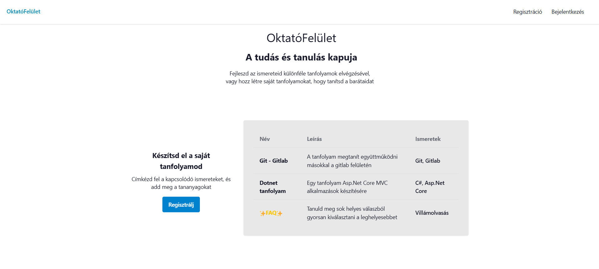
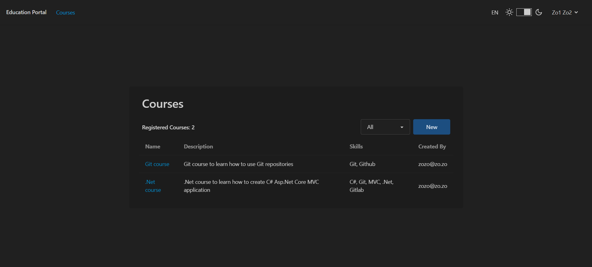
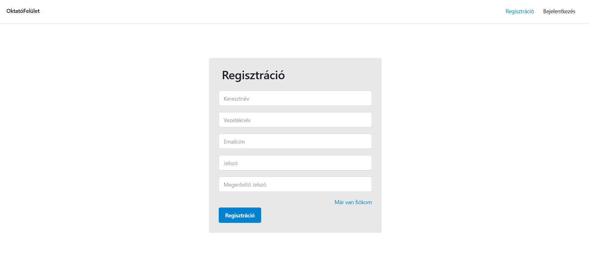
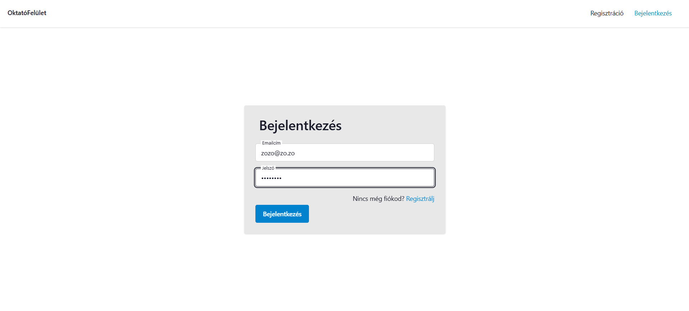
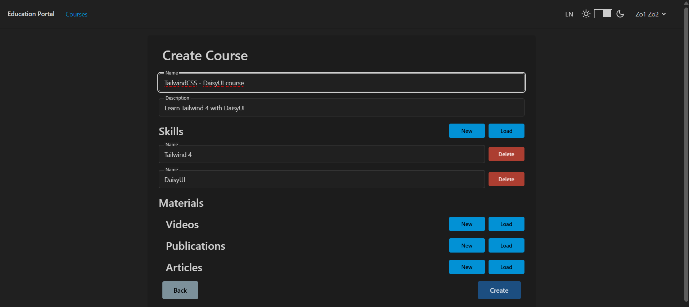
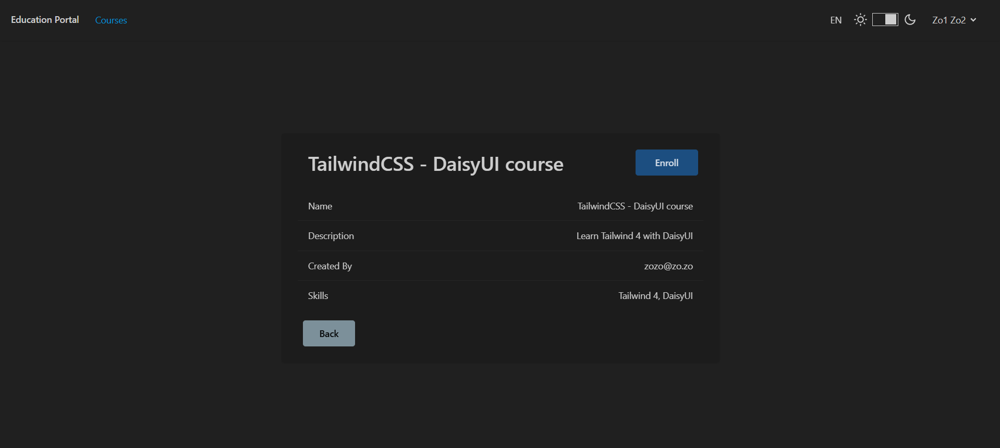
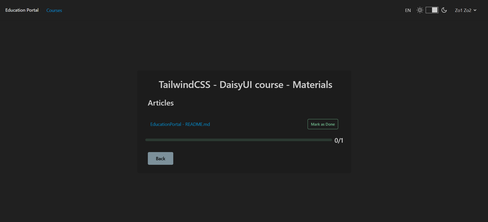
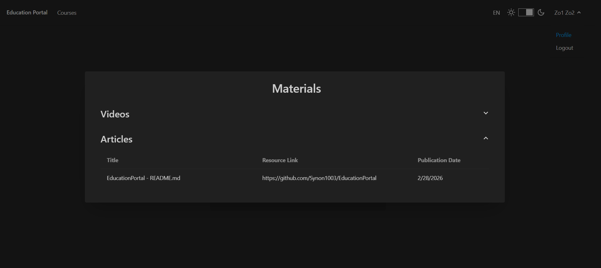

# EducationPortal
EducationPortal is available in 2 languages, Hungarian and English  
Check the [application](https://educationportalapp-cpdqc9g5abh9epg0.polandcentral-01.azurewebsites.net/)
### Images

| Homepage |
| :---: |
|  |

<details>
<summary>Click to view the full gallery</summary>

| Courses |
| :---: |
|  |

| RegistrationPage |
| :---: |
|  |

| LoginPage |
| :---: |
|  |

| Create Course |
| :---: |
|  |

| Course Details |
| :---: |
|  |

| Course Materials |
| :---: |
|  |

| Profile Materials |
| :---: |
|  |

</details>

### Development
Run the application on https://localhost:7133 | http://localhost:5012
```bash
cd EducationPortal.Web
dotnet run
```

### Production
Deployed by Github Actions to [Azure](https://educationportalapp-cpdqc9g5abh9epg0.polandcentral-01.azurewebsites.net/)  
But it can be run by Docker locally  

Db-only:
```bash
docker compose up educationportalsqldb
```
Both containers: this will run the application on http://localhost:8080
```bash
docker compose up
```

### Migrations

```bash
dotnet ef migrations add MigrationName --project EducationPortal.Data -o Migrations --startup-project EducationPortal.Web

dotnet ef database update --project EducationPortal.Data --startup-project EducationPortal.Web
```

### Testing
Unit tests:
```bash
cd EducationPortal.Tests
dotnet test
dotnet test --filter "FullyQualifiedName~CourseServiceTests"
```

### Tailwind DaisyUI
The application should be responsive and mobile friendly due to tailwind  
Installed as development dependency
```bash
cd EducationPortal.Web
npm init --yes
npm install -D tailwindcss @tailwindcss/cli
npm install -D tailwindcss@latest postcss autoprefixer
npm install -D daisyui
```

Used to build css before dotnet build
```bash
npm run css:build
```